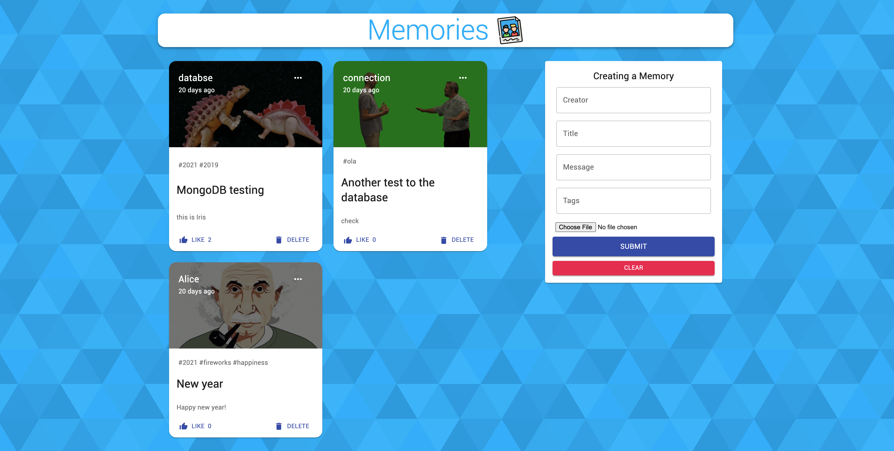

# Capstone Project - "Memories"

## Introduction
This is an an interactive full-stack social media web application similar to Facebook (Meta) where users can create, delete or like multi-media posts.

## Some Bullet Points
1. Investigated various tech stacks and picked MERN stack to build this application end-to-end from scratch in 1 month.
2. Leveraged React-Redux structure that effectively enhanced the program’s CRUD cycle, letting data be managed consistently and handled easily between the front-end and back-end.
3. Utilized: MongoDB, Express.js, React.js, Node.js, Material-UI, REST API, etc.

## Set Up
1. Run 'npm install' to install necessary node modules
2. Run 'npm start' on both client and server side to start the application